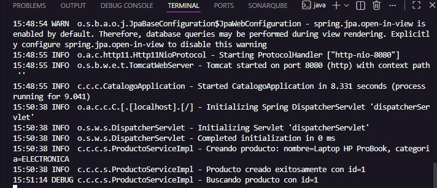
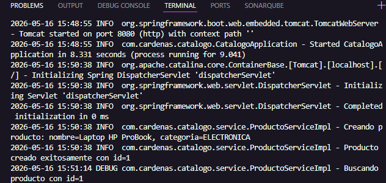
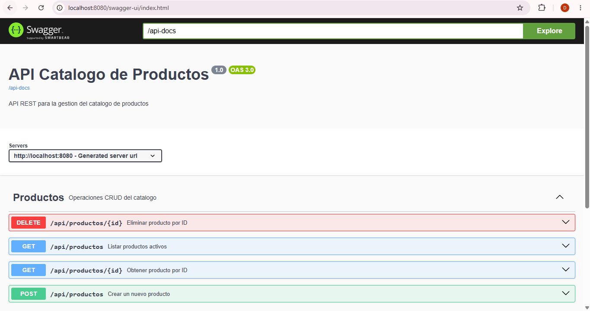
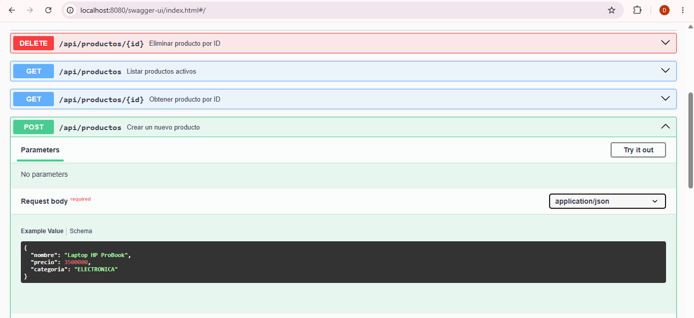

# Post Contenido 2 - Unidad 11

Logging con SLF4J/Logback y documentacion con Swagger/OpenAPI.

## Requisitos
- Java 17+
- Maven 3.9+

## Ejecucion
```bash
mvn spring-boot:run
```

## Swagger UI
- URL: http://localhost:8080/swagger-ui.html

## Logs
- Archivo: logs/catalogo.log

## Evidencias

### Evidencia 1 — Mensajes SLF4J en consola


### Evidencia 2 — Archivo logs/catalogo.log


### Evidencia 3 — Swagger UI

